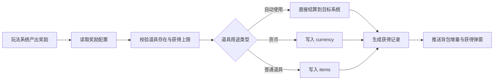
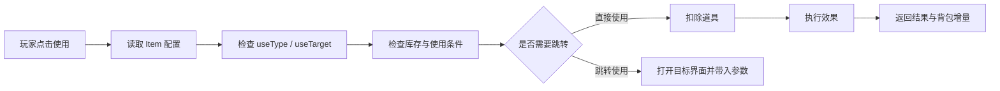

# 玩家背包与道具系统

## 概述

玩家背包承载组织经营中的可持有资源、消耗品、材料、法器、任务物品和功能入口。它不是独立仓库，而是连接“获得奖励 -> 查看用途 -> 使用 / 跳转 -> 消耗生效 -> 继续参与系统”的通用中台。

当前协议已有基础结构：

```proto
message BackpackPb {
  map<int32, int64> currency = 1; // 货币
  map<int32, ItemPb> items = 2;   // 道具
}

message ItemPb {
  optional int32 id = 1;    // id
  optional int64 count = 2; // 数量
}
```

后续扩展应优先保持这个轻量结构：普通堆叠道具只存 `id + count`；只有装备、法器、限时道具等需要实例属性时，再新增实例背包或扩展字段。

## 一、道具分类

| 分类 | 说明 | 是否进背包 | 典型来源 | 典型使用 |
|:----|:-----|:----------:|:---------|:---------|
| 货币 | 灵石、功德、魂玉等高频数值 | 否，进入 `currency` | 日常、轮回结算、活动 | 商店、升级、加速 |
| 消耗品 | 丹药、符箓、宝箱、加速令 | 是 | 副本、任务、活动、礼包 | 直接使用、批量使用 |
| 材料 | 五行精矿、灵木心、火晶石等 | 是 | 采集、矿点、秘境 | 炼丹、炼器、阵法升级 |
| 法器 | 飞剑、灵珠、阵盘、法袍等 | 早期可堆叠，后期可实例化 | 炼器、掉落、活动 | 装备、充能、接入阵法 |
| 功法 / 法术书 | 解锁或升级修炼能力 | 是 | 秘境、道统、商店 | 学习、升阶、跳转修炼 |
| 任务物品 | 任务链和世界事件凭证 | 是 | 任务、探索、事件 | 提交、合成、触发剧情 |
| 随机包 | 奖励容器 | 是 | 活动、结算、礼包 | 打开后转化为奖励组 |

## 二、获得流程

所有系统发奖应统一走背包服务，不允许各系统自行改背包数据。



### 获得来源

| 来源 | 说明 | 展示要求 |
|:----|:-----|:---------|
| 地图采集 | 灵气节点、五行矿点、凡人城镇产出 | 显示采集点名称和产出列表 |
| 阵法产出 | 聚灵阵、炼丹阵、炼器阵自动产出 | 支持批量收取和离线汇总 |
| 修炼 / 突破 | 境界突破、功法研究奖励 | 显示来源系统与提升结果 |
| 战斗 / 掠夺 | PVP、攻城、跨服入侵 | 区分战利品与被掠夺资源 |
| 秘境 / 事件 | 限时副本和地图事件 | 高品质道具需要突出展示 |
| 道统任务 | 司天、幽冥、真武贡献奖励 | 关联道统贡献与阶段目标 |
| 轮回结算 | 小 / 中 / 大轮回结算奖励 | 可进入结算页查看明细 |
| 商店 / 交易 | 市场、玩家交易、活动商店 | 必须显示消耗与获得预览 |
| GM / 补偿 | 测试、运营补偿 | 记录来源，便于追踪 |

### 背包入库规则

- 数量必须为正数；0 数量忽略。
- 道具 ID 必须存在于道具配置表。
- 货币类写入 `BackpackPb.currency`，普通道具写入 `BackpackPb.items`。
- 自动使用类道具不进入背包，直接触发对应系统逻辑。
- 溢出时应整体失败，避免部分奖励入库。
- 同一批奖励应生成一条可追踪的获得记录，便于弹窗、日志和问题排查。

## 三、使用流程



### 使用类型

| 使用类型 | 配置值建议 | 行为 |
|:--------|:-----------|:-----|
| 不可使用 | `none` | 只展示来源和用途 |
| 直接使用 | `direct` | 点击后扣除并执行效果 |
| 批量使用 | `batch` | 支持选择数量或一键全部使用 |
| 打开礼包 | `open_reward` | 按奖励组掉落产出道具 |
| 跳转界面 | `jump` | 打开目标系统，不直接消耗 |
| 学习 / 解锁 | `learn` | 解锁功法、法术或阵法图纸 |
| 装备 / 装配 | `equip` | 装备法器，或接入阵法节点 |
| 提交任务 | `submit` | 跳转任务 / 事件界面提交 |

### 使用校验

- 玩家库存数量足够。
- 道具未过期，且当前服务器阶段允许使用。
- 满足等级、组织等级、境界、道统、地图区域等条件。
- 批量使用必须按单次效果规则逐项结算，或配置明确的批量公式。
- 使用失败不得扣除道具；扣除和效果应在同一事务内完成。

## 四、跳转与用途

背包中的“使用”和“前往”都依赖配置表，不写死在界面里。

| 场景 | 按钮文案 | 跳转目标 |
|:----|:---------|:---------|
| 灵气材料不足 | 前往采集 | 地图资源点筛选页 |
| 阵法材料 | 前往阵法 | 阵法升级 / 布阵界面 |
| 法器材料 | 前往炼器 | 炼器阵或法器工坊 |
| 丹药 | 使用 | 直接恢复 / 加速修炼 |
| 功法残卷 | 前往修炼 | 功法研究或经脉界面 |
| 道统令牌 | 前往道统 | 道统任务 / 捐献界面 |
| 任务物品 | 前往任务 | 对应任务详情 |
| 礼包 | 打开 | 奖励预览与开启弹窗 |

### 跳转参数建议

| 字段 | 说明 | 示例 |
|:----|:-----|:-----|
| `jumpType` | 跳转类型 | `map_resource`、`formation_upgrade` |
| `jumpParam` | 跳转参数 | `resourceType=fire_ore` |
| `sourcePanel` | 来源界面 | `backpack` |
| `highlightTarget` | 目标高亮 | 阵法 ID、任务 ID、资源点类型 |

## 五、多语言规则

- 道具名称、描述、来源、按钮文案全部使用多语言 key，不直接写死中文。
- 道具表中保存 `nameKey`、`descKey`，语言表中保存具体文本。
- 道具描述允许占位符，如 `{value}`、`{duration}`、`{element}`，参数由 `effectParam` 或展示层计算。
- 服务端错误信息可以先保留中文日志，但发给客户端的错误码应由客户端转多语言。
- 缺失语言 key 时客户端显示 key 本身，并上报埋点，便于补文案。

## 六、界面设计

### 背包主界面

- 顶部：标题、容量、搜索框、排序按钮。
- 左侧：全部、消耗、材料、法器、功法、任务、礼包。
- 中部：道具格子，显示图标、品质框、数量、红点、限时角标。
- 右侧：道具详情，显示名称、品质、描述、拥有数量、来源、用途。
- 底部：根据 `useType` 动态显示按钮：使用、批量使用、打开、前往、装备、提交。

### 道具详情弹窗

| 区域 | 内容 |
|:----|:-----|
| 标题区 | 图标、名称、品质、类型 |
| 描述区 | 多语言描述、效果预览 |
| 数量区 | 当前拥有、最大堆叠、是否限时 |
| 来源区 | 来源列表，每项带“前往”按钮 |
| 操作区 | 使用、批量使用、前往、关闭 |

### 获得弹窗

- 小额普通奖励可进入底部轻提示。
- 多个奖励使用“获得道具列表”弹窗，按品质排序。
- 高品质道具使用独立展示动画，但不阻断太久。
- 支持从获得弹窗直接点击道具查看详情。

### 使用反馈

- 使用成功：展示消耗数量和效果结果。
- 使用失败：展示多语言错误原因。
- 跳转成功：关闭背包或压栈打开目标界面，目标项高亮。
- 批量使用：展示数量选择器，默认使用 1，支持最大。

## 七、与现有代码的衔接建议

- `BackPackService.addItem` 当前写死 `ItemType.of(1)`，后续应改为读取道具配置中的类型与使用规则。
- `removeItem` 扣到 0 后建议删除 `items` 中的条目，减少同步数据体积。
- 增加统一奖励入口：`addReward(player, rewardId, sourceType)`，让玩法系统只引用奖励组。
- 增加背包增量推送协议：获得、扣除、使用结果不要每次全量同步。
- GM 加道具继续保留，但要校验道具配置是否存在。

## 八、MVP 范围

第一版建议只做：

1. 普通堆叠道具：`id + count`。
2. 货币与普通道具分开存储。
3. 道具基础表、多语言表、来源跳转表。
4. GM 加道具、任务 / 地图 / 阵法产出统一入库。
5. 直接使用、打开礼包、前往跳转三类操作。
6. 背包主界面、道具详情弹窗、获得弹窗。

法器实例化、限时道具、交易锁定、绑定状态、随机词条等放到后续版本。
